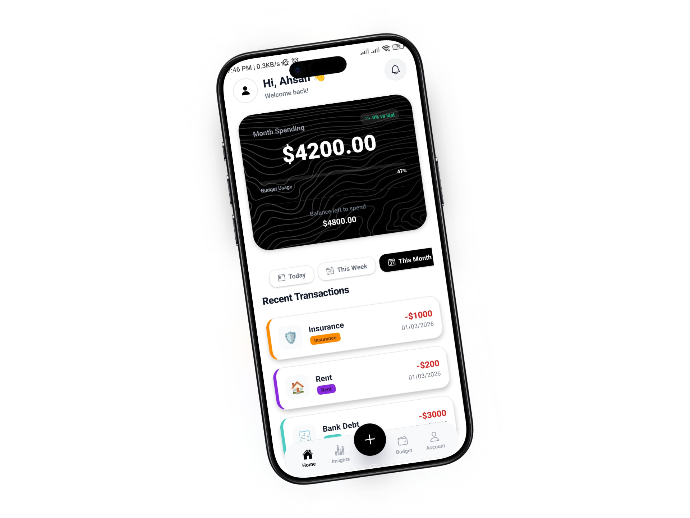
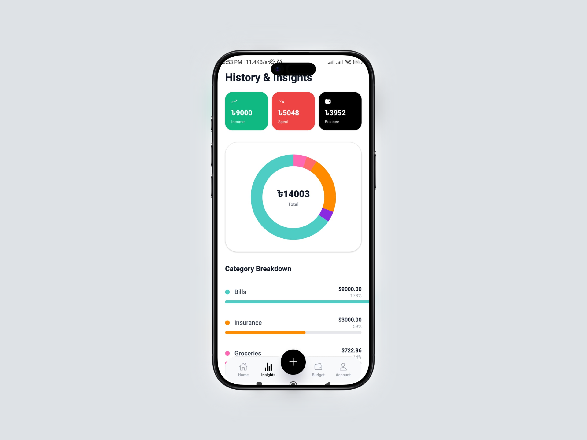
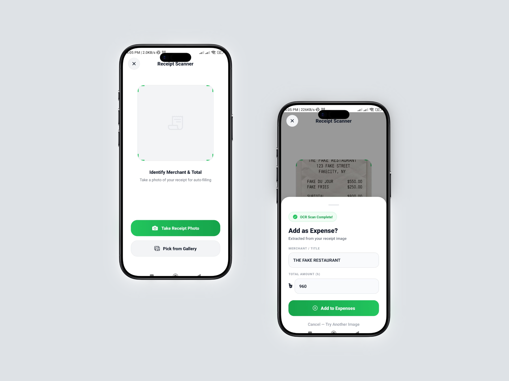
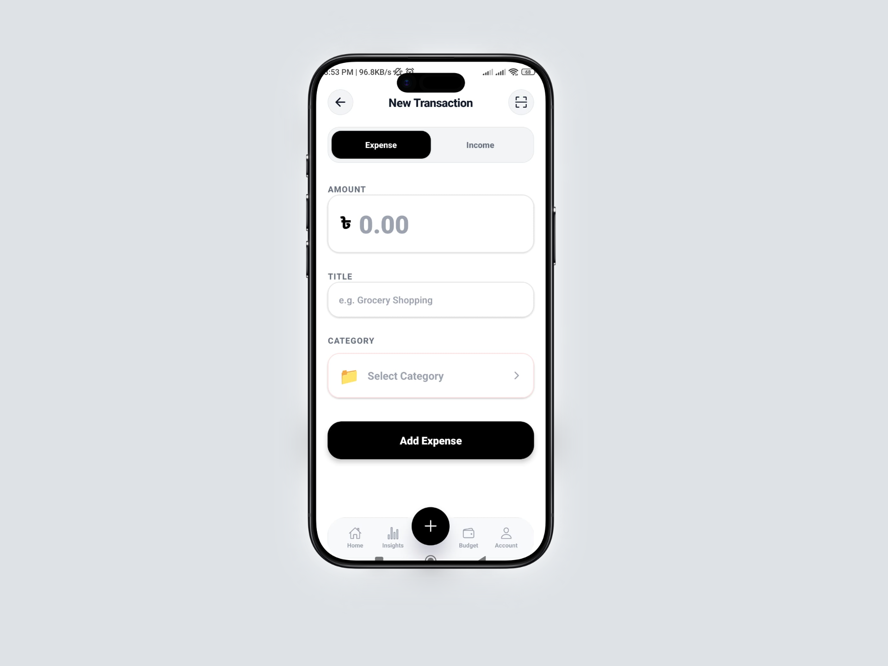
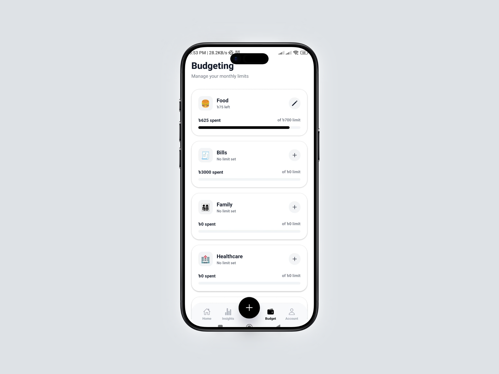
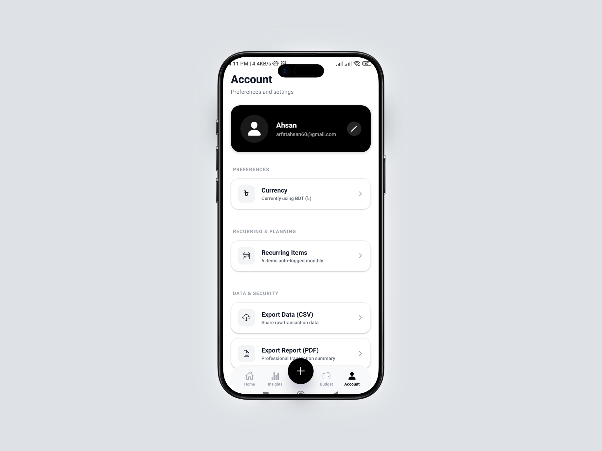

<div align="center">
  
  <h1>Wallety - AI Budget Tracker</h1>
  <p><i>A sleek, AI-powered personal finance manager built with React Native & Expo.</i></p>

  <p>
    <a href="https://reactnative.dev/"></a>
    <a href="https://expo.dev/"></a>
    <a href="https://groq.com/"></a>
    <a href="https://firebase.google.com/"></a>
  </p>
</div>

<br/>

## 🌟 About The App

Take control of your finances with a beautifully designed, high-performance expense tracker. Styled in a sleek "Panda" (Black & White) aesthetic, this app makes logging, tracking, and budgeting your transactions effortless.

Instead of manually typing out receipts, simply snap a picture! Powered by **Groq Llama 4 Vision**, the app instantly extracts transaction data from physical receipts and categorizes them intelligently.

<p align="center">
  
   
  
</p>

---

## ✨ Key Features

### 📸 AI-Powered Receipt Scanner
*   **Groq Llama Vision:** Uses blazing-fast `meta-llama/llama-4-scout-17b-16e-instruct` API.
*   **Zero-Shot Extraction:** Instantly converts camera snapshots of receipts into perfectly structured JSON data (Title, Amount, Category).
*   **Panda Themed UI:** The scanner screen matches the app's minimalist black & white style perfectly.

### 💰 Smart Budgeting & Analytics
*   **Category Budgets:** Set specific spending limits for completely custom categories.
*   **Intelligent Warnings:** Receive app alerts when you approach or exceed your category budget.
*   **Interactive Insights:** Visualize your spending and savings across different periods (Today, Weekly, Monthly, All Time).
*   **Automatic Monthly Resets:** Seamlessly rolls over your budget and balances into the next calendar month so you always start fresh.
*   **PDF Exports:** Generate beautifully formatted PDF reports of your monthly summaries to save or share.

### ⏰ Advanced Custom Reminders
*   **Never Forget:** Set custom native push notifications using a built-in calendar and time picker.
*   **Quick Schedule:** Handy shortcuts to set reminders for "In 1 Hour", "Tomorrow morning", etc.
*   **Active Management:** View and cancel scheduled reminders directly from your dashboard.

### 🔌 Powerful Under-the-Hood
*   **Auto-Categorization Library:** Smart keyword detection massive dictionary (e.g., "uber" -> Transport).
*   **Firebase Authentication & Firestore:** Seamlessly sync your data securely to the cloud.
*   **Offline Mode Capabilities:** Designed with AsyncStorage to keep your wallet data intact even when offline.

<p align="center">
  
  
  
</p>

---

## 🛠️ Tech Stack

*   **Frontend Ecosystem:** React Native, Expo SDK 54, NativeWind / Tailwind CSS
*   **AI Engine:** Groq SDK (Llama 4 Vision Instruct)
*   **Backend / DB:** Firebase Auth & Firestore
*   **State / Storage:** React Native Context API and AsyncStorage
*   **Native Modules:** `expo-image-picker`, `@react-native-community/datetimepicker`, `expo-notifications`

---

## 🚀 Getting Started

To run this app locally, you need a basic React Native Expo environment set up.

1.  **Clone the Repository**
    ```bash
    git clone https://github.com/your-username/expense-tracker.git
    cd expense-tracker
    ```

2.  **Install Dependencies**
    ```bash
    npm install
    ```

3.  **Environment Variables (`.env`)**
    Create a `.env` file in the root directory and add your keys:
    ```bash
    EXPO_PUBLIC_FIREBASE_API_KEY=your_firebase_api_key
    GROQ_API_KEY=your_groq_api_key
    ```

4.  **Start the Expo Server**
    ```bash
    npx expo start -c
    ```

Scan the generated QR code using the **Expo Go** app on your physical device, or run it on an iOS/Android Simulator!

---

## 🤝 Roadmap / Future Ideas
*   [ ] Multi-currency support
*   [ ] Sync with live bank accounts (Plaid integration)

---

<div align="center">
  <i>Made with ❤️ for better personal finance.</i>
</div>
